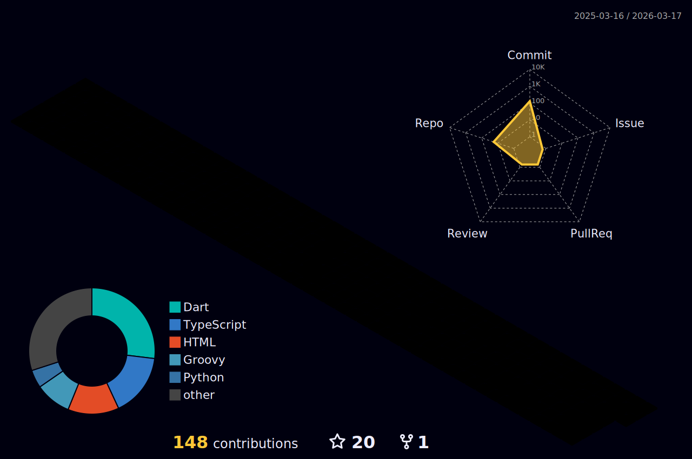

  

<h1 align="center"✨ >
        <samp>&gt; Hi There!👋, I am
                <b><a target="_blank" href="">Hoang Phuc
</a></b>
        </samp>
</h1>

  

<table align="center" style="width:100;">
  <tr>
    <td align="center" style="width:50;">
      
    </td>
    <td align="center" style="width:50;">
      
    </td>
  </tr>
</table>

<h2 align="center"> Connect with Me </h2>

 
 
 
  
  

 

<h2 align="center"> Technologies </h2>

### Programming Languages:

  <table>
    <tr>
      <td style="border:2 solid #ccc; padding:10; border-radius:8;">
        
      </td>
      <td style="border:2 solid #ccc; padding:10; border-radius:8;">
        
      </td>
      <td style="border:2 solid #ccc; padding:10; border-radius:8;">
        
      </td>
      <td style="border:2 solid #ccc; padding:10; border-radius:8;">
        
      </td>
      <td style="border:2 solid #ccc; padding:10; border-radius:8;">
        
      </td>
        <td style="border:2 solid #ccc; padding:10; border-radius:8;">
        
      </td>
    </tr>
  </table>

### Mobile Development:

  <table>
    <tr>
      <td style="border:2 solid #ccc; padding:10; border-radius:8;">
        
      </td>
      <td style="border:2 solid #ccc; padding:10; border-radius:8;">
        
      </td>
      <td style="border:2 solid #ccc; padding:10; border-radius:8;">
        
      </td>
      <td style="border:2 solid #ccc; padding:10; border-radius:8;">
        
      </td>
      <td style="border:2 solid #ccc; padding:10; border-radius:8;">
        
      </td>
    </tr>
  </table>

### Backend & APIs: 

  <table>
    <tr>
      <td style="border:2 solid #ccc; padding:10; border-radius:8;">
        
      </td>
      <td style="border:2 solid #ccc; padding:10; border-radius:8;">
        
      </td>
      <td style="border:2 solid #ccc; padding:10; border-radius:8;">
        
      </td>
      <td style="border:2 solid #ccc; padding:10; border-radius:8;">
        
      </td>
      <td style="border:2 solid #ccc; padding:10; border-radius:8;">
        
      </td>
      <td style="border:2 solid #ccc; padding:10; border-radius:8;">
        
      </td>
    </tr>
  </table>

### Databases: 

  <table>
    <tr>
      <td style="border:2 solid #ccc; padding:10; border-radius:8;">
        
      </td>
      <td style="border:2 solid #ccc; padding:10; border-radius:8;">
        
      </td>
      <td style="border:2 solid #ccc; padding:10; border-radius:8;">
        
      </td>
    </tr>
  </table>

### AI / Machine Learning: 

  <table>
    <tr>
      <td style="border:2 solid #ccc; padding:10; border-radius:8;">
        
      </td>
      <td style="border:2 solid #ccc; padding:10; border-radius:8;">
        
      </td>
      <td style="border:2 solid #ccc; padding:10; border-radius:8;">
        
      </td>
      <td style="border:2 solid #ccc; padding:10; border-radius:8;">
        
      </td>
    </tr>
  </table>

### Tools & Platforms: 

  <table>
    <tr>
      <td style="border:2 solid #ccc; padding:10; border-radius:8;">
        
      </td>
      <td style="border:2 solid #ccc; padding:10; border-radius:8;">
        
      </td>
      <td style="border:2 solid #ccc; padding:10; border-radius:8;">
        
      </td>
      <td style="border:2 solid #ccc; padding:10; border-radius:8;">
        
      </td>
      <td style="border:2 solid #ccc; padding:10; border-radius:8;">
        
      </td>
      <td style="border:2 solid #ccc; padding:10; border-radius:8;">
        
      </td>
    </tr>
  </table>

